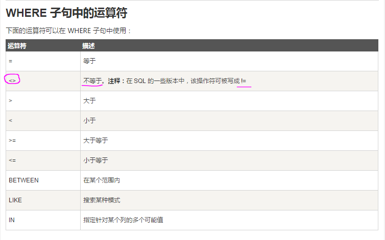

# sql-where  

http://www.runoob.com/sql/sql-where.html

## WHERE 子句中的运算符  
下面的运算符可以在 WHERE 子句中使用：  
运算符	描述  
=	等于  
<>	不等于。注释：在 SQL 的一些版本中，该操作符可被写成 !=  
>	大于  
<	小于  
>=	大于等于  
<=	小于等于  
BETWEEN	在某个范围内  
LIKE	搜索某种模式  
IN	指定针对某个列的多个可能值  

